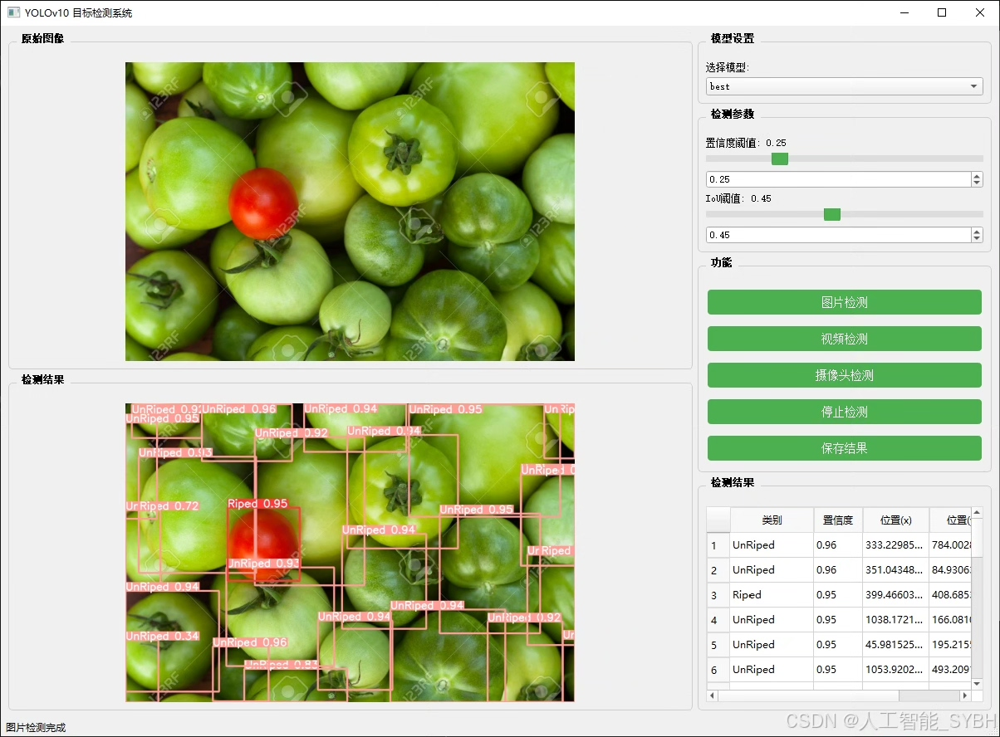
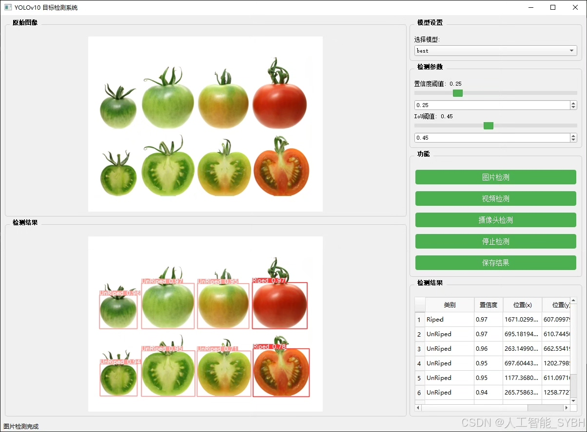
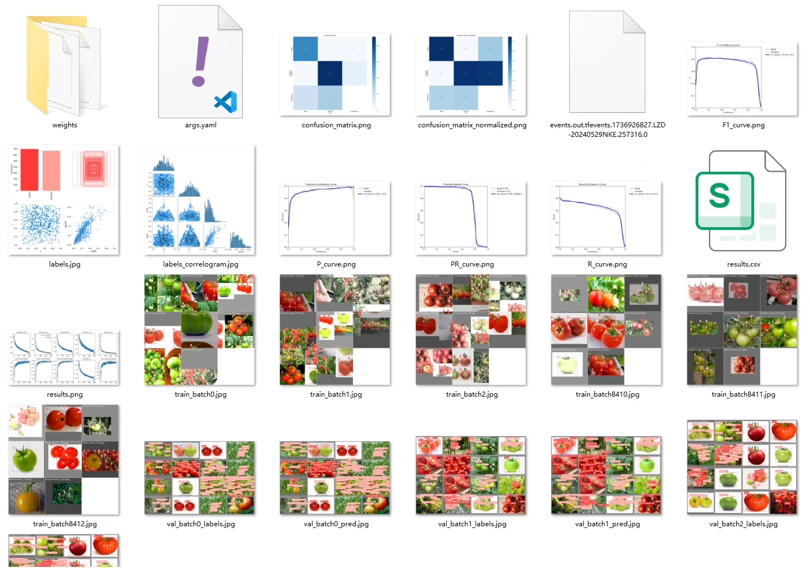
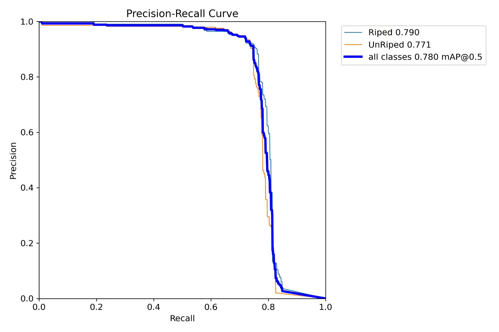
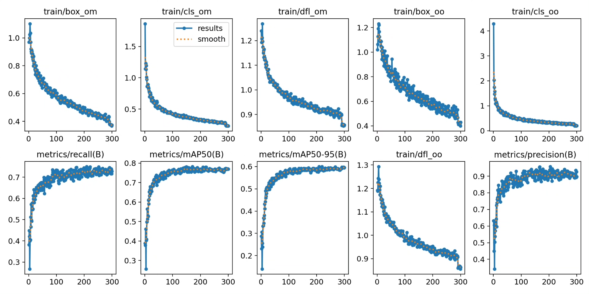
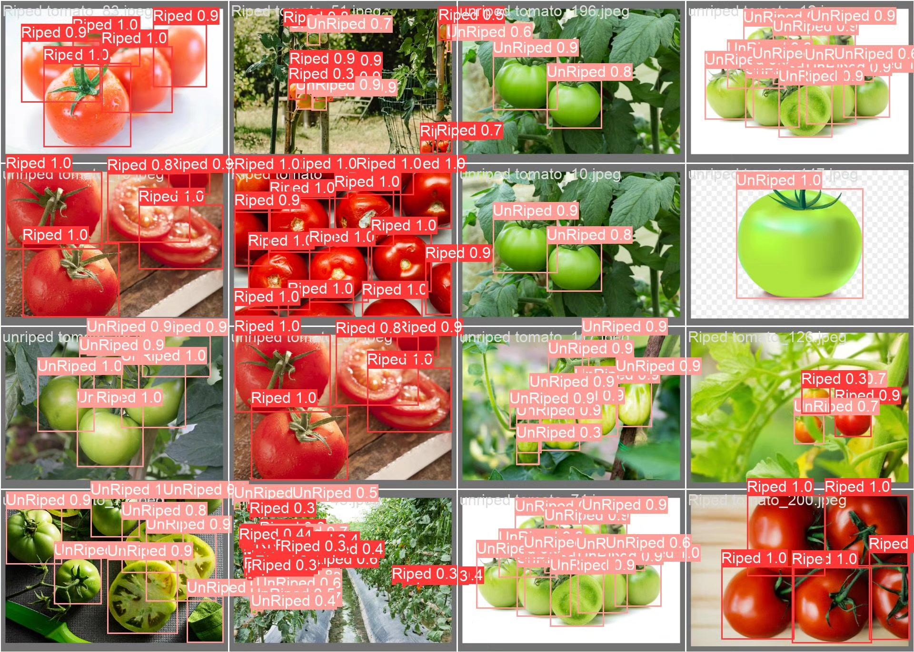
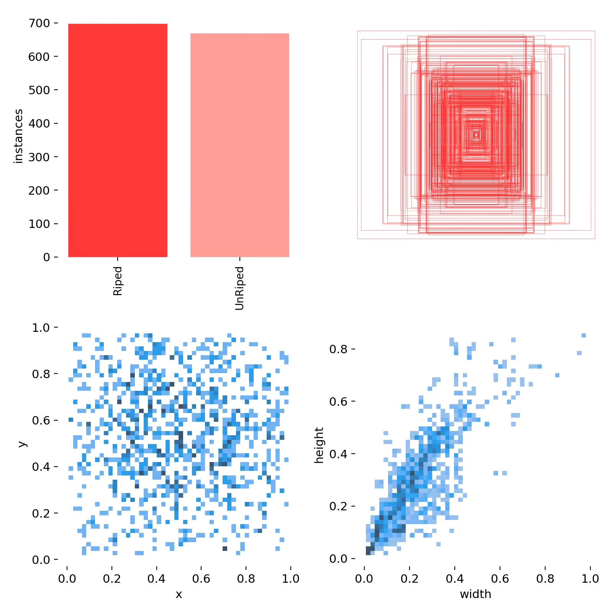
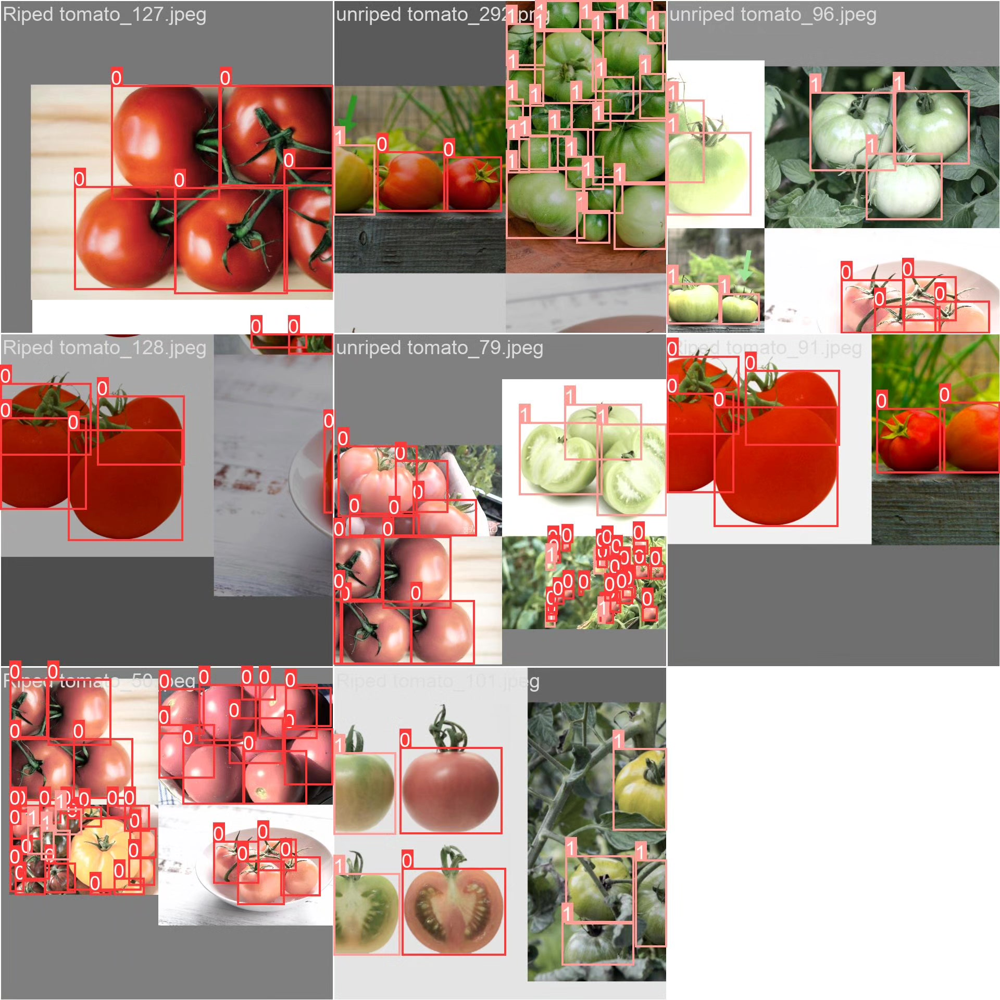

# Tomato ripeness detection system based on deep learning YOLOv10

## Body

Based on deep learning YOLOv10, a tomato maturity detection system (YOLOv10+YOLO dataset + UI interface + Python project source code + model)

In agricultural production, the detection of tomato maturity is a key factor in determining the timing of harvest and product quality. Traditional methods of maturity detection rely on manual observation, which are inefficient and subjective, making it difficult to meet the needs of large-scale planting. With the development of computer vision and deep learning technology, automatic detection systems based on images for tomato maturity have gradually become a research hotspot. This project utilizes the YOLOv10 object detection algorithm to achieve automatic detection of tomato maturity, providing technical support for precision agriculture.

Our company's products have obtained the official commercial license certification from YOLO.

We provide after-sales service.

After payment, we will provide WeChat IDs for instant questions and answers.

Environmental configuration: We will provide an instructional tutorial on environmental configuration, with WeChat available for Q&A.
Remote installation services: If you need remote configuration, an additional fee of 69 is required,
failure in configuration will result in all fees being refunded (specially for old computers only refund installation fees).

Retraining datasets: After setting up the environment, you can train on your own computer.
If you need us to retrain, just pay 69 plus computing power fees (2.5 yuan/hour).

Full package of after-sales service

## Images

## Payment

Here is a pay link on Stripe ( https://buy.stripe.com/3cs8yP7sY87d0vu9AB ). Please contact me lonlonago@foxmail.com after funding $89, and I will send you a complete data files , thank you!

